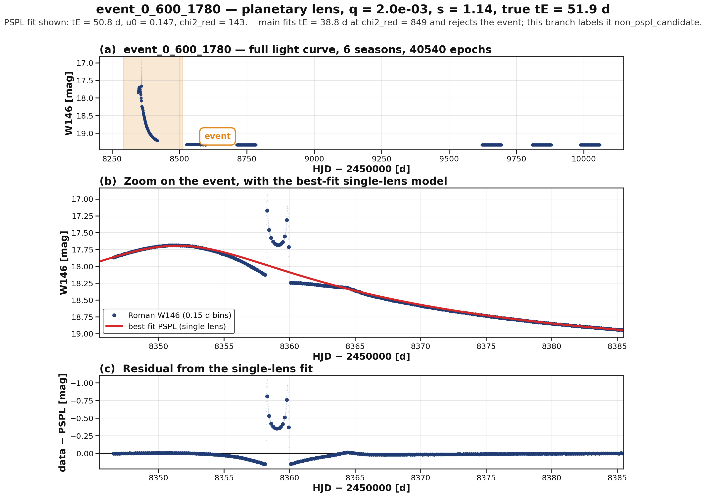
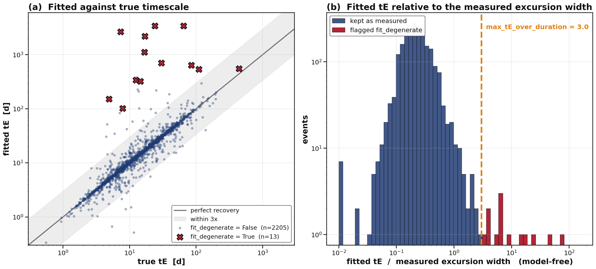
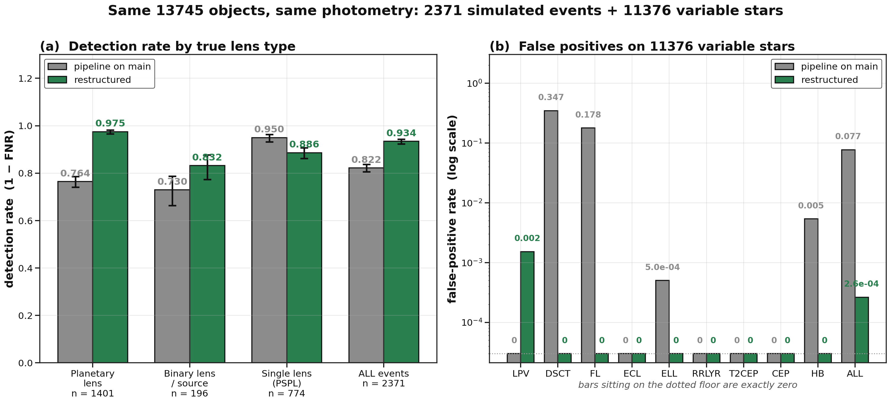
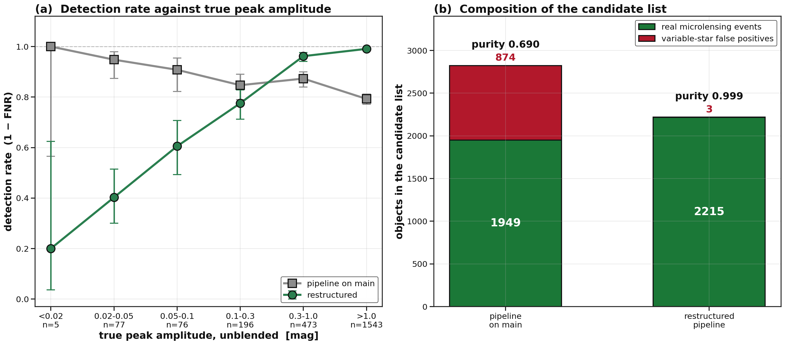
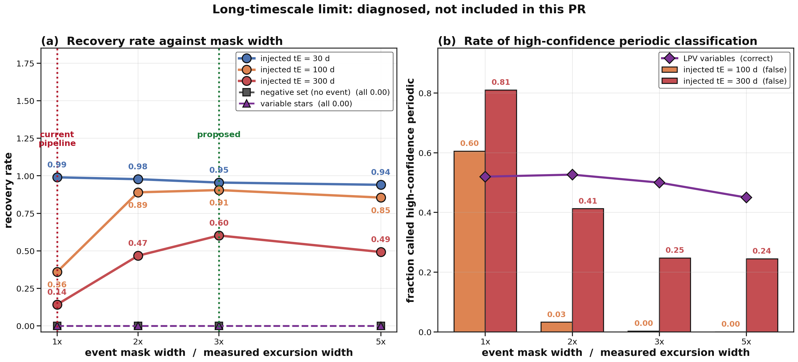

# Separating detection from classification — measurement report

Branch: `agent/season-free-coherence-detection`
Compared against: `main` (`9c2bbd6`)
Evaluation data: 2371 events from `sample_rtmodel_v2.4`, 11376 variable stars from the `roman_variable` catalogue, and 2369 negative light curves built from the same photometry.

Both pipelines were run on the same objects, the same photometry, and the same single band (Roman W146).

---

## 0. Summary

| Metric | main | this branch |
|---|---|---|
| FNR (2371 events) | 0.1780 | **0.0658** |
| FPR (11376 variable stars) | 0.0768 | **0.00026** |
| FPR (2369 negatives) | — | **0.00000** |
| Candidate-list purity | 0.690 | **0.9986** |
| Detection rate, 1401 planetary lenses | 0.7645 | **0.9750** |

FNR and FPR move down together; this is not a threshold trade.

The one measurement that motivates the whole restructure is in §5.2: on `main`, the detection rate *decreases* with the true peak amplitude of the event, from 1.00 below 0.02 mag to 0.79 above 1 mag. §1 explains the mechanism.

---

## 1. The chi2_red_pspl < 2.5 gate

On `main`, candidacy is decided by one condition (`src/aethra/pspl.py`, `fit_pspl_candidate`):

```python
good_pspl_fit = (... and pspl_result["chi2_red_pspl"] < good_pspl_chi2)   # default 2.5
is_candidate  = bool(good_pspl_fit)
```

and the pipeline applies it directly (`src/aethra/pipeline.py`):

```python
is_candidate = bool(scan_candidate and pspl_info["is_candidate"] and not is_variable_star)
```

So an object is a candidate if and only if a single-lens model fits it well.

Planetary and binary signals are, by construction, departures from PSPL, and they raise the chi2 of a single-lens fit. The gate reads "the model does not fit" as "there is no event", which removes the class of events the survey is designed to find.

### Worked example: `event_0_600_1780`



Simulation truth (`Models/event_summary_q_s.csv`, `Nature.txt`):

- planetary lens, mass ratio `q = 2.01e-3`, projected separation `s = 1.14`, `tE = 51.9 d`
- RTModel's own verdict: `Successful: Planetary lens with parallax`
- chi2 of the single-lens model 5311443, of the planetary model 42268 — a factor of 126

`main` fits `tE = 38.8 d` at `chi2_red = 849` and rejects the object. This branch fits `tE = 50.8 d`, `u0 = 0.147` at `chi2_red = 143` (the improved seeding of §4.1 recovers the true timescale to 2%), which is still far above 2.5, so the gate would reject it either way. The event is detected here and labelled `non_pspl_candidate`.

Panel (c) shows what the gate is reacting to: a caustic crossing that leaves a 0.81 mag residual against a per-epoch photometric error of 0.005 mag. That residual is the planetary signal.

### The example is representative

| True lens type | n | fraction with `chi2_red > 2.5` |
|---|---:|---:|
| planetary lens | 1401 | **0.228** |
| single lens | 774 | 0.049 |

The gate fires 4.6 times more often on planetary events than on single-lens ones. Of the 418 events that `main` rejects and this branch detects, 408 (97.6%) have `true_q < 0.03`, with a median mass ratio of `2.8e-4` (Earth to Neptune mass range). By RTModel category: `Planetary lens` 150, `Planetary lens with parallax` 82, `Planetary lens with orbital motion` 69.

---

## 2. Change: detect first, classify second

The pipeline is reordered as follows.

```
Stage 2  coherent_peak_scan       model-free multi-scale coherence  -> scan_candidate
Stage 1  renormalize_errors       baseline scatter -> error scale   -> veto_baseline_variable
Stage 3  fit_pspl_full            PSPL fitted as a classification axis
Stage 4  residual_structure       is there localized structure in the residual
Stage 5  _classify                fold the above into one label
```

Whether an event occurred is decided before PSPL is fitted. The fit is then used to sort candidates, not to remove them.

`src/aethra/pipeline.py:79-95`:

```python
def _classify(scan_candidate, is_variable_star, fit, structure):
    if is_variable_star:
        return "variable_star"
    if not scan_candidate:
        return "no_event"
    if fit is None:
        return "fit_failed"
    if structure["residual_significant"]:
        return "non_pspl_candidate" if structure["residual_localized"] else "non_pspl_unexplained"
    return "pspl_like"
```

With `EVENT_LABELS = ("pspl_like", "non_pspl_unexplained", "non_pspl_candidate")` and `event_candidate = label in EVENT_LABELS`, a poor PSPL fit no longer costs an object its candidacy — however large chi2 is, the object is routed to `non_pspl_*`.

`fit_failed` (the fit did not converge numerically) is **not** in `EVENT_LABELS`. Given the argument above, a numerical failure in the classification stage arguably should not cancel a detection either, so this may belong in `EVENT_LABELS`. No object in the full run takes that label, so the measurements here are unaffected; the decision is left to review (§9).

Label distribution over the full run:

| label | events | variable stars |
|---|---:|---:|
| `pspl_like` | 1998 | 3 |
| `non_pspl_candidate` | 205 | 0 |
| `non_pspl_unexplained` | 12 | 0 |
| `no_event` | 152 | 5616 |
| `variable_star` | 4 | 5757 |

205 objects fall into `non_pspl_candidate` — detected, with localized structure left in the PSPL residual. That category cannot exist under the `main` logic.

---

## 3. New detection stage — `coherence.py`

`main` has no stage that decides whether an event happened. It searches for a bump season by season with `analyze_season_scan`, then fits PSPL to the best season. A quiet light curve admits a flat PSPL at `chi2_red ~ 1`, which is the mechanism behind both the 874 variable-star false positives and the amplitude dependence in §5.2.

`coherent_peak_scan` in `src/aethra/coherence.py` (378 lines) does the following:

1. bin to nightly medians
2. robust normalization (median, MAD × 1.4826)
3. multi-scale smoothing by running median at half-widths `(2, 4, 7, 14, 30)` d
4. `score = max(smoothed, 0) × sqrt(nights in window)`

It does not use season boundaries, so events that straddle a season gap and data with a single season are both handled. `min_peak_score = 40` is the only threshold.

### Rejected variants, kept in the docstring with their measurements

| variant | recall | variable-star FP |
|---|---|---|
| default (symmetric MAD, `n_refine=0`) | 0.928 | 0.010 |
| one-sided MAD | 0.928 (unchanged) | 0.016 |
| `n_refine=1` (iterated baseline) | 0.928 (unchanged) | 0.029 |

Both sharpen the baseline estimate, and both sharpen it equally for events and for variables, so neither gains anything.

---

## 4. Other problems found and fixed

### 4.1 PSPL seeding — `pspl_seed.py` (new, 248 lines)

`fit_pspl` optimizes locally from a single starting point and settles into deep local minima. `fit_pspl_full` builds seeds from a grid over `t0`, `tE` and `u0` and takes the best result. `event_0_600_1780` in §1 is one case: `main` returns `tE = 38.8 d` against a truth of 51.9 d, this branch returns 50.8 d.

### 4.2 The runaway branch of the tE-u0 degeneracy — `fit_degenerate` (new column)



`tE` and `u0` trade off along nearly constant `teff = u0·tE`. The low-`u0` arm of that valley can win on chi2 without describing the light curve. The worst case in the run is `event_0_713_2670`: true `tE = 7.3 d`, fitted `tE = 2645 d` with `u0 = 1e-4` pinned at the fit boundary, and `chi2_red = 1.06` — no chi2-based check would notice.

The criterion used is self-consistency rather than chi2. Stage 2 measures the width of the excursion without a model, and a PSPL bump cannot be narrower than its own `tE`, so a fit claiming a timescale much longer than the measured width is inconsistent with the data it is supposed to describe:

```python
fit_degenerate = fit["tE_fit"] > max_tE_over_dur * scan["main_duration_days"]   # default 3.0
```

Threshold choice, over the 2218 fitted events (49 of which are truly wrong by more than 3x, 15 by more than 10x):

| threshold | flagged | purity | catches of the 15 >10x errors |
|---|---:|---:|---:|
| 1x | 49 (2.2%) | 0.449 | 15/15 |
| 2x | 19 (0.9%) | 0.737 | 12/15 |
| **3x (default)** | **13 (0.6%)** | **0.923** | **10/15** |
| 5x | 10 (0.5%) | 0.900 | 8/15 |

At 1x the flag fires on more well-measured events than badly measured ones, which would train a reader to ignore it. The default is 3x.

The flag is reported, not vetoed. The event is real and detected; it is the timescale the data do not pin down, so it is exposed as a column rather than used to drop the object.

Two alternatives were measured and rejected: `frac_explained < 0.5` catches the same 15 cases but drags in 192 others (purity 0.078); requiring `u0` to sit at the fit boundary flags 14 objects, 5 of which are genuine high-magnification events.

### 4.3 Variable-star identification — `variability.py` (new, 209 lines)

`error_renorm`, the error-scale factor returned by `renormalize_errors`, is used as a model-free variability statistic. A large value means the baseline is not constant away from the event, which is the definition of a variable star and does not require a period. This is what catches semi-regular LPVs whose periodograms are messy.

Events and variables sit two orders of magnitude apart on either side of the default 1000 (largest value among detected events 645, smallest among detected variables 92000).

`periodicity_with_event_masked` masks the event window before searching for a period, with a mask width of `max(main_duration_days, 2·tE_fit)`.

### 4.4 Data with neither seasons nor a PSPL fit — `8beb746`

`main` implicitly requires both season splitting and a converged PSPL fit to succeed. `coherent_peak_scan` does not use seasons, so detection now works on single-season data. Where the fit does not converge, the `fit_failed` label at least distinguishes "an event was seen but no model could be fitted" from "nothing is there" (whether that label should count as a candidate is the open question in §2).

### 4.5 `roman_variable` catalogue loader — `roman_variable.py` (new, 158 lines)

Reads the FITS variable-star catalogue, which is what makes the false-positive rates in §5.1 measurable per class.

---

## 5. Results

### 5.1 Detection rate by lens type, false positives by variable class



Planetary lenses: 0.7645 → 0.9750, i.e. 1071 → 1366 of 1401.

Variable-star false positives: 874 → 3. The dominant contributors on `main` are DSCT (0.347) and FL (0.178) rather than LPV.

The 3 remaining false positives are all shifted LPVs, with `peak_score` just above the threshold of 40 (42.9–44.8) and `chi2_red` between 247 and 791. A chi2 cut would remove them, but that is the cut this PR removes, so they are accepted as a consequence of the design. Removing them would need a different axis.

### 5.2 The regression on single-lens events



On single-lens (PSPL) events the detection rate goes down: 0.950 → 0.886.

Panel (a) shows where that comes from. On `main` the detection rate falls monotonically with the true peak amplitude, from 1.00 below 0.02 mag to 0.79 above 1 mag. That ordering follows from selecting on fit quality rather than on significance:

- a quiet light curve admits a flat PSPL at low chi2, so low-amplitude objects pass — which is also why 874 variables pass
- a strong event carries larger anomalies, which raise chi2 — so strong events are rejected

The 152 events this branch misses have a median true amplitude of 0.087 mag; the 418 it gains have a median of 2.454 mag.

Panel (b) is the operational consequence, i.e. what a person inspecting the candidate list would see:

- `main`: 874 of 2823 entries are variable stars (1 in 3)
- this branch: 3 of 2218 (1 in 739)

### 5.3 Negative set — real photometry with no event

To measure the effect of systematics rather than simulation, negatives were built from the 2371 event light curves by removing the season containing the event (median 33783 points, 6 seasons, 1713 days). These are real Roman photometry with real systematics and no microlensing.

0 of 2369 are candidates [0.00000, 0.00162]. `scan_candidate` fires 0 times, `hc_periodic` 0 times.

### 5.4 Injection-recovery

PSPL signals injected into real photometry (`mag_inj = mag − 2.5·log10(A)`, unblended `fs=1`), `tE ∈ {1,3,10,30,100,300} × u0 ∈ {0.05,0.2,0.5,1.0}`, 14214 injections:

- `tE ≤ 30 d`: recovery ≥ 0.98 at every `u0`, including `u0 = 1.0` (ΔM = 0.32 mag)
- recovered `tE` is accurate throughout: median ratio 1.000, 98.9% within ±20%, none wrong by more than 3x
- `tE = 100 d`: 0.847; `tE = 300 d`: 0.618 (see §6)

---

## 6. Known limit, diagnosed but not included in this PR



Recovery drops for long events. The controlling variable is not `tE` itself but the fraction of the observing span the event occupies: recovery is 0.643 for `4·tE/span > 0.4` and 0.591 for `> 0.8`.

The cause is the mask width, not the detector. For `tE = 300 d` injections, 0.634 exceed `peak_score > 40`, but only 0.1425 survive to the end. The loss is downstream: the rising and falling wings of the event leak past the mask and register as a period near 190 d, so `hc_periodic` fires on 81% of those injections.

Setting the mask width to 3x the measured excursion width moves `tE = 100` from 0.360 to 0.905 and `tE = 300` from 0.1425 to 0.6025, at no measured cost: negative FP 0.0, variable-star FP 0.0 in all nine classes, and correct periodic identification of LPVs almost unchanged at 0.520 → 0.500. Panel (b) shows why the change is not symmetric: a variable star has many cycles across the span, so hiding one does not remove its period, whereas an event has only one.

Two sites would need to change: the `mask_days` floor at `pipeline.py:264`, and `renormalize_errors` at `pipeline.py:205`. The latter runs before the fit, so it cannot use `2·tE_fit` and stays at the bare excursion width; this creates an ordering-dependent chain of inflated renorm → `veto_baseline_variable` → no fit → mask never widened.

It is left out of this PR because only 24 of the 2371 events have `tE > 100 d`, and 21 of those are already detected. The change would move 2–3 objects on this sample. It matters for the real long-`tE` tail (heavy lenses, the massive end of free-floating objects); the measurements and the sweep scripts are kept for that.

### Other known, unfixed points

- **`t0_fit` time system** — `pipeline.py:350` subtracts 2450000 on output, inherited from `main`, which assumes the input is full JD. roman_simu times are already HJD−2450000, so that output column does not line up with `peak_time` or `truth_t0` in the same table. The pipeline uses the raw fitted value internally, so results are unaffected, but the column needs care when read.
- **Single band** — F146 only. `veto_chromatic` fires 0 times in the full run; colour information is effectively unused.
- **Blending** — injections use `fs = 1`, which overestimates amplitude. Bulge crowding gives `fs = 0.1–0.3` typically, so the effective FNR is worse than §5.4.
- **Low mass ratio** — `residual_localized` follows `q` monotonically (0.031 → 0.049 → 0.087 → 0.180 → 0.194), but reaches only 0.031 for `q < 1e-5`.

---

## 7. New config keys and output columns

### Config keys (all have defaults, read through `config.get`)

| key | default | role |
|---|---|---|
| `min_peak_score` | 40.0 | Stage 2 detection threshold; the only detection decision |
| `max_error_renorm` | 1000.0 | error scale above which the baseline itself is treated as variable |
| `residual_min_peak_score` | 40.0 | threshold for calling residual structure significant |
| `residual_localization_tE` | 2.0 | how many `tE` from `t0` residual structure may sit and still count as localized |
| `max_tE_over_duration` | 3.0 | ratio at which `fit_degenerate` is raised |

### Output columns

`OUTPUT_COLUMNS` has 48 entries. The main additions:

| column | meaning |
|---|---|
| `label` | five-valued classification (§2) |
| `event_candidate` | candidate flag, `label ∈ EVENT_LABELS` |
| `peak_score` | Stage 2 coherence score |
| `main_duration_days` | model-free width of the main excursion |
| `residual_significant` / `residual_localized` | presence and localization of residual structure |
| `fit_degenerate` | `tE` suspected to sit on the degenerate branch (§4.2) |
| `error_renorm` | error-scale factor |
| `veto_baseline_variable` / `hc_periodic` | the two variable-star axes |

`is_candidate` is retained for backward compatibility.

---

## 8. Reproducing this

```bash
pytest tests/            # includes the tests added on this branch
ruff check src tests
```

The numbers above come from:

1. full run over 2371 events + 11376 variable stars → `pipeline_full.csv`
2. the same objects run in a `main` worktree → `pipeline_main.csv`
3. true lens types collected from `Nature.txt` and `Models/event_summary_q_s.csv`
4. negative set: 2369 light curves with the event season removed
5. injection grid: 14214 injections
6. figures: `docs/figures/*.png`

Six ECL/ELL FITS files carry no usable extension and are excluded (13753 → 13747). This is a data-side problem, not a code defect.

---

## 9. Suggested review order

1. **§1** — whether `chi2_red < 2.5` selectively removes planetary events. Everything else follows from agreeing or disagreeing with this.
2. **§5.2 panel (a)** — the detection rate on `main` falling with amplitude.
3. **§4.2 `fit_degenerate`** — catching the degeneracy by self-consistency rather than chi2. The threshold is a config key.
4. **§5.1, the 3 remaining false positives** — whether this is an acceptable cost for dropping the chi2 gate.
5. **Whether `fit_failed` belongs in `EVENT_LABELS`** (§2). No object takes that label in this run, so no measurement changes either way.
6. **§6, long events** — whether a separate PR is the right split. The measurements are done, so it can be folded in if preferred.
